# 📚 Sistem Manajemen Perpustakaan

Sistem manajemen perpustakaan modern berbasis web yang dibangun menggunakan **Laravel 13**. Aplikasi ini menyediakan fitur lengkap untuk mengelola koleksi buku, data anggota, transaksi peminjaman & pengembalian, laporan, serta dashboard analytics.

---

## ✨ Fitur Lengkap

### 📊 Dashboard
- [✅] Statistik utama (total buku, anggota aktif, sedang dipinjam, terlambat, dll)
- [✅] Quick Action cards — akses cepat ke seluruh modul
- [✅] Pie chart — distribusi kategori buku
- [✅] Bar chart — top 10 buku terpopuler
- [✅] Line chart — trend peminjaman 6 bulan terakhir
- [✅] Donut chart — status transaksi (Dipinjam vs Dikembalikan)
- [✅] Widget buku terlambat — daftar transaksi overdue lengkap dengan estimasi denda
- [✅] Tabel transaksi terbaru

### 📖 Manajemen Buku
- [✅] CRUD buku (Create, Read, Update, Delete)
- [✅] Pencarian buku (judul, pengarang, ISBN)
- [✅] Filter berdasarkan kategori (Programming, Database, Web Design, Networking, Data Science)
- [✅] Bulk delete buku
- [✅] Export data buku ke CSV
- [✅] Detail buku lengkap dengan status stok
- [✅] Accessor: format harga, status ketersediaan, badge stok, label tahun

### 👥 Manajemen Anggota
- [✅] CRUD anggota (Create, Read, Update, Delete)
- [✅] Pencarian anggota (nama, email, telepon)
- [✅] Filter berdasarkan jenis kelamin, status, pekerjaan
- [✅] Export data anggota ke Excel (.xlsx)
- [✅] Generate kode anggota otomatis
- [✅] Detail anggota dengan informasi lengkap
- [✅] **Riwayat peminjaman** — timeline visual semua transaksi anggota
- [✅] **Statistik peminjaman** — total pinjam, total denda, masih dipinjam
- [✅] **Filter riwayat by status** — Semua / Dipinjam / Dikembalikan

### 🔄 Transaksi Peminjaman & Pengembalian
- [✅] Buat transaksi peminjaman baru
- [✅] Generate kode transaksi otomatis (TRX-001, TRX-002, ...)
- [✅] Auto-set tanggal kembali (7 hari dari tanggal pinjam)
- [✅] Pengembalian buku dengan konfirmasi SweetAlert
- [✅] Hitung denda otomatis (Rp 5.000/hari keterlambatan)
- [✅] Update stok buku otomatis (decrement saat pinjam, increment saat kembali)
- [✅] Detail transaksi lengkap

### ⚠️ Notifikasi Terlambat
- [✅] Dashboard widget "Buku Terlambat" — jumlah & daftar lengkap
- [✅] Badge "Terlambat X hari" di index transaksi
- [✅] Alert detail di halaman detail transaksi
- [✅] Estimasi denda real-time

### 📋 Laporan
- [✅] Laporan transaksi dengan filter (tanggal, status, anggota)
- [✅] Export laporan ke PDF
- [✅] Halaman laporan umum

### 🔍 Pencarian Global
- [✅] Pencarian lintas modul (buku & anggota)

### 🔐 Autentikasi
- [✅] Login & Register (Laravel Breeze)
- [✅] Profile management
- [✅] Route protection (auth middleware)

---

## 📸 Screenshots

Berikut adalah beberapa tampilan antarmuka dari Sistem Manajemen Perpustakaan:

### 📊 Dashboard
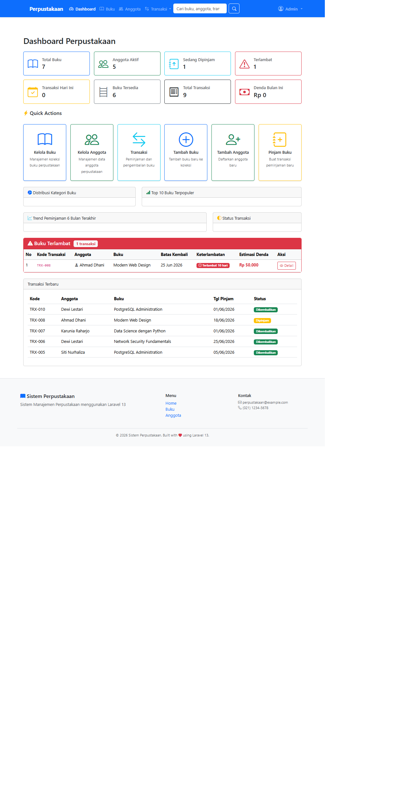

### 🔑 Autentikasi & Profil
| Login | Register | Profile |
|:---:|:---:|:---:|
| 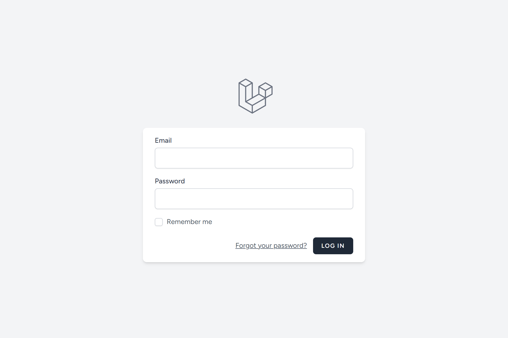 | 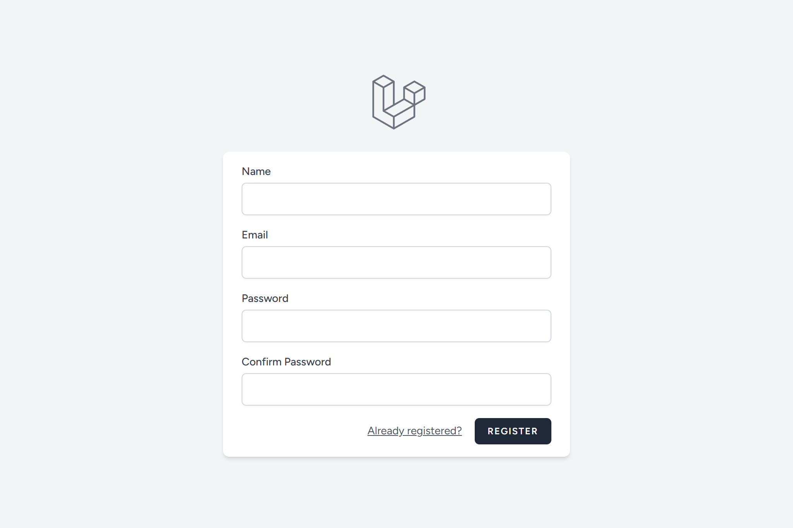 | 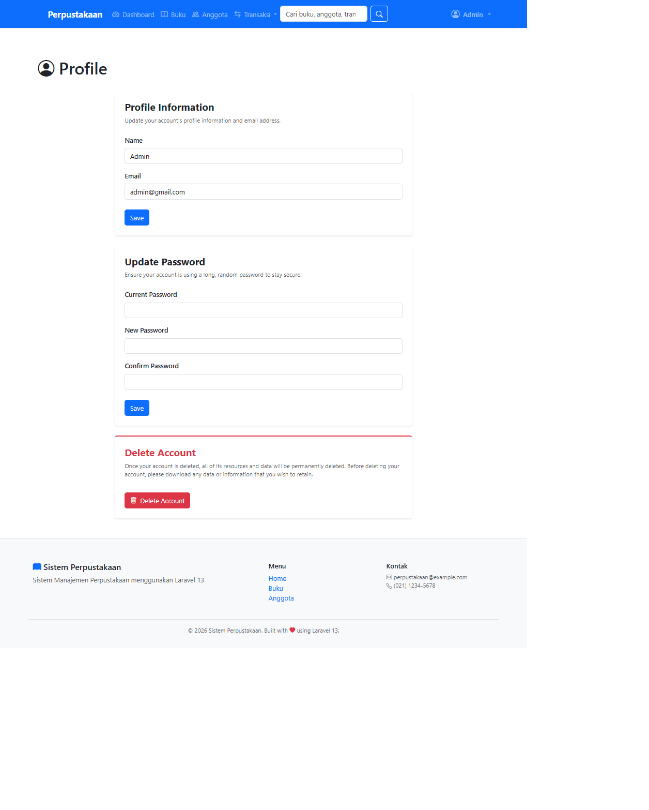 |

### 📖 Manajemen Buku
| Daftar Buku | Detail Buku |
|:---:|:---:|
| 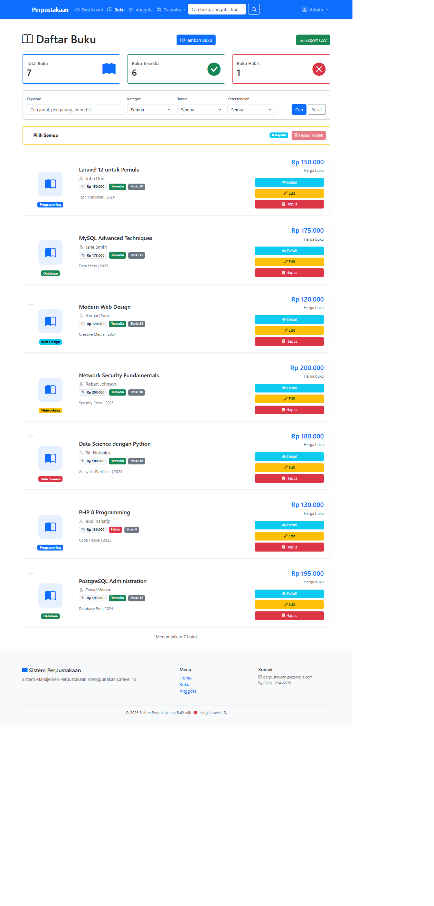 | 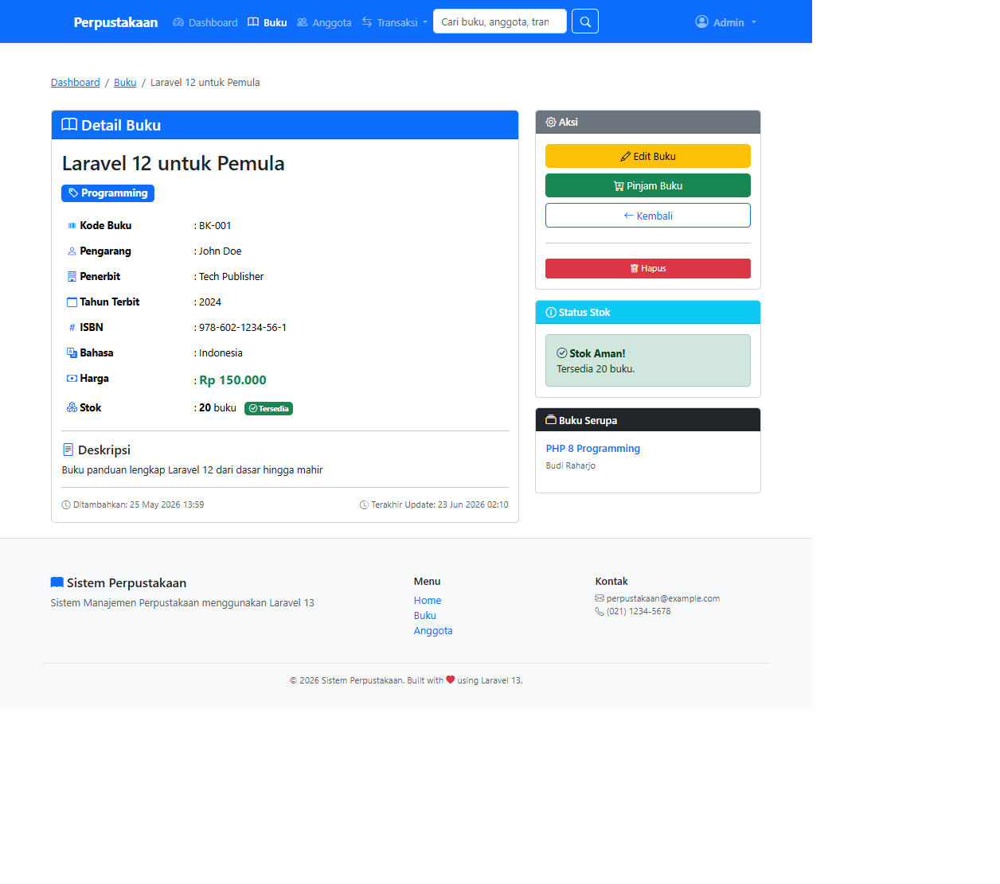 |

### 👥 Manajemen Anggota
| Daftar Anggota | Detail Anggota |
|:---:|:---:|
| 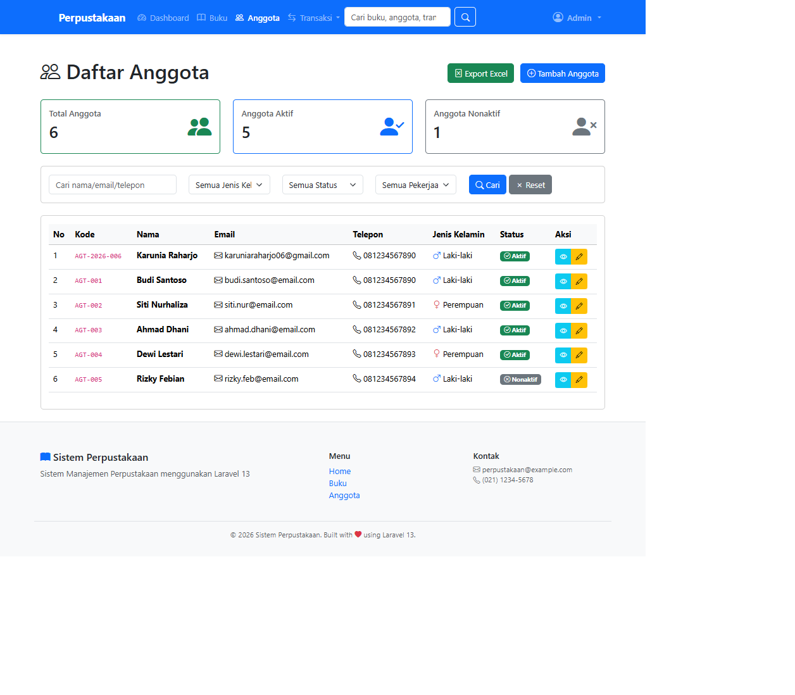 | 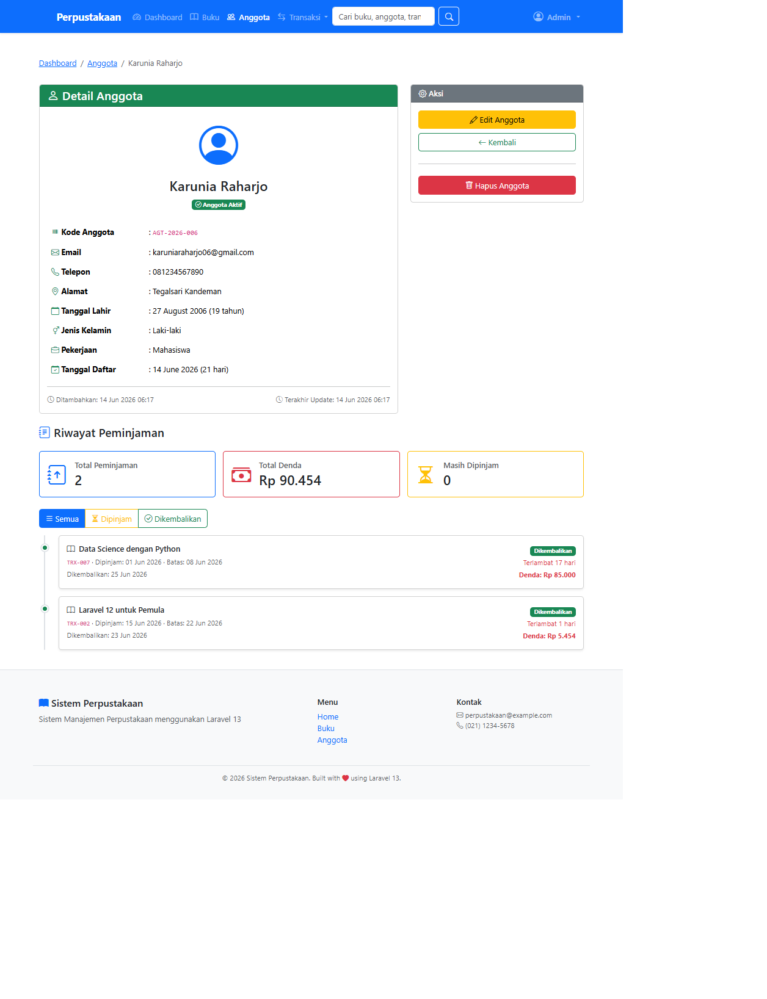 |

### 🔄 Transaksi Peminjaman & Pengembalian
| Daftar Transaksi | Detail Transaksi |
|:---:|:---:|
| 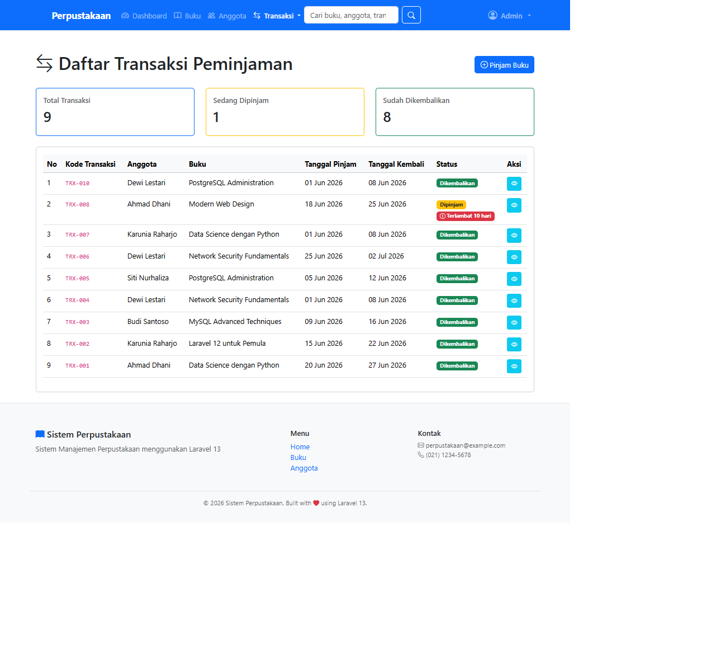 | 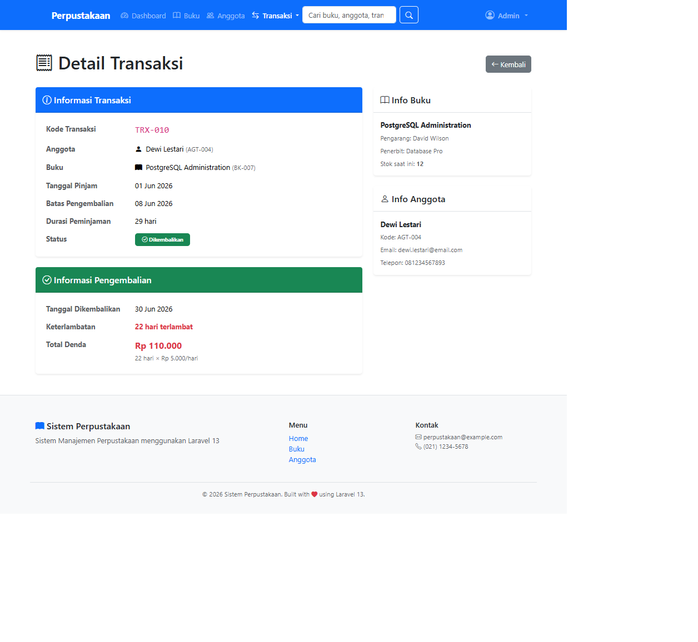 |

### 🔍 Fitur Lainnya
| Pencarian Global |
|:---:|
| 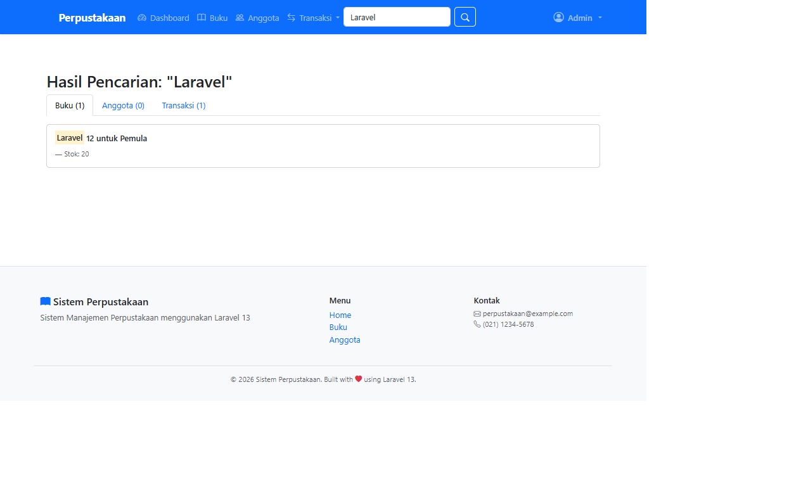 |

---

## 🚀 Instalasi

### Prasyarat
- PHP >= 8.3
- Composer
- Node.js & NPM
- MySQL / MariaDB
- XAMPP (opsional, untuk kemudahan)

### Langkah-langkah

1. **Clone repository**
   ```bash
   git clone https://github.com/ardhiartha/pemweb-final.git
   cd perpustakaan
   ```

2. **Install dependencies PHP**
   ```bash
   composer install
   ```

3. **Install dependencies Node.js**
   ```bash
   npm install
   ```

4. **Konfigurasi environment**
   ```bash
   cp .env.example .env
   php artisan key:generate
   ```

5. **Konfigurasi database**
   
   Edit file `.env` dan sesuaikan konfigurasi database:
   ```env
   DB_CONNECTION=mysql
   DB_HOST=127.0.0.1
   DB_PORT=3306
   DB_DATABASE=perpustakaan_laravel
   DB_USERNAME=root
   DB_PASSWORD=
   ```

6. **Buat database**
   
   Buat database `perpustakaan_laravel` di MySQL/MariaDB:
   ```sql
   CREATE DATABASE perpustakaan_laravel;
   ```

7. **Jalankan migrasi database**
   ```bash
   php artisan migrate
   ```

8. **Build assets frontend**
   ```bash
   npm run build
   ```

9. **Jalankan aplikasi**
   ```bash
   php artisan serve
   ```
   
   Atau gunakan shortcut:
   ```bash
   composer dev
   ```
   
   Akses aplikasi di: [http://localhost:8000](http://localhost:8000)

---

## 🛠️ Tech Stack

| Teknologi | Versi | Kegunaan |
|-----------|-------|----------|
| **Laravel** | 13.x | PHP Framework utama |
| **PHP** | >= 8.3 | Backend runtime |
| **MySQL** | 8.x | Database |
| **Bootstrap** | 5.3 | CSS Framework |
| **Bootstrap Icons** | 1.11 | Ikon |
| **Chart.js** | Latest | Dashboard charts |
| **SweetAlert2** | 11.x | Konfirmasi dialog |
| **Laravel Breeze** | 2.x | Autentikasi |
| **DomPDF** | 3.x | Export PDF |
| **Maatwebsite Excel** | 3.x | Export Excel |
| **Vite** | Latest | Asset bundler |
| **TailwindCSS** | 4.x | Utility CSS (via Vite) |

---

## 📁 Struktur Project

```
perpustakaan/
├── app/
│   ├── Exports/           # Export classes (Excel)
│   ├── Http/
│   │   ├── Controllers/   # Controller utama
│   │   └── Requests/      # Form Request validation
│   ├── Models/            # Eloquent Models
│   │   ├── Anggota.php
│   │   ├── Buku.php
│   │   ├── Kategori.php
│   │   ├── Transaksi.php
│   │   └── User.php
│   └── Rules/             # Custom validation rules
├── database/
│   ├── factories/
│   ├── migrations/        # Database migrations
│   └── seeders/
├── resources/
│   └── views/
│       ├── anggota/       # Views CRUD anggota
│       ├── buku/          # Views CRUD buku
│       ├── transaksi/     # Views transaksi & laporan
│       ├── layouts/       # Layout utama, navbar, footer
│       ├── dashboard.blade.php
│       └── home.blade.php
├── routes/
│   └── web.php            # Route definitions
└── ...
```

---

## 👤 Author

| | Info |
|---|---|
| **Nama** | Surya Ardhiartha Putro Utomo |
| **NIM** | 60324038 |
| **Mata Kuliah** | Pemrograman Web 2 |
| **Dosen Pengampu** | Mohammad Reza Maulana, M.Kom. |
| **Universitas** | UIN K.H. Abdurrahman Wahid Pekalongan |
| **Tahun** | 2026 |

---

## 📝 Lisensi

Project ini dibuat untuk keperluan akademik mata kuliah Pemrograman Web 2.

---

<p align="center">
  Dibuat dengan ❤️ menggunakan Laravel 13
</p>
